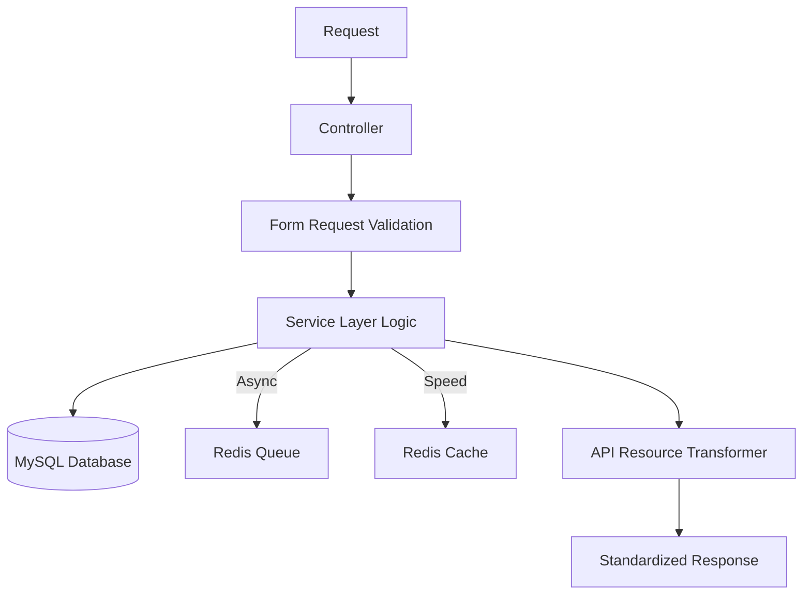

# API Architecture

The Luxe Parfum API is built with a deep emphasis on **Separation of Concerns (SoC)** and **Clean Architecture** principles. It follows a strictly layered approach to ensure maximum maintainability and testability.

### 🏗️ Layered Hierarchy

1.  **Transport Layer (Controllers)**
    Controllers act as thin entry points. Their responsibilities are limited to:
    - Initializing the request flow.
    - Orchestrating calls to the Service Layer.
    - Returning standardized JSON responses via API Resources.

2.  **Validation Layer (Form Requests)**
    Every mutable endpoint is protected by a dedicated Form Request. This ensures that business logic never receives malformed or untrusted data.

3.  **Core Business Engine (Service Layer)**
    Located in `app/Services`, this is where 100% of the business logic resides. Services are decoupled from HTTP concerns, making them easily testable and reusable for CLI commands or internal jobs.

4.  **Data Modeling (Eloquent Models)**
    Models represent the domain entities. We leverage advanced features like **Soft Deletes**, **Accessors/Mutators**, and **Translatable JSON columns** (Spatie Translatable).

5.  **Transformation Layer (API Resources)**
    We never return models directly. API Resources act as a decoupled presentation layer, allowing us to evolve our database schema without breaking client integrations.

### 🗺️ System Flow Diagram

