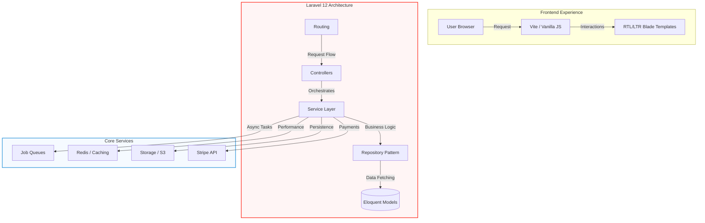

# ⚜️ Luxe Parfum - Professional eCommerce Portfolio Project

<p align="center">
  
  <br>
  <strong>A high-performance Perfume eCommerce Solution developed with Laravel 12.</strong>
</p>

---

## 💎 Project Overview
This project is a comprehensive eCommerce system built to demonstrate advanced **Laravel 12** expertise, clean architecture, and data-driven business logic. It solves real-world retail challenges like accurate historical profit tracking, bilingual user experiences, and high-performance data reporting.

---

## 🛠️ System Architecture & Design Patterns

### 🛰️ Technical Workflow Diagram


### 🛡️ Clean Architecture Implementation
This project follows a professional **Controller-Service-Repository** pattern to ensure a strict separation of concerns:

1. **Controllers**: Act as entry points, handling request validation and returning responses. They remain "thin" by delegating all logic to services.
2. **Service Layer**: The "Brain" of the application. It contains the business logic (e.g., calculating profits, processing discounts) and interacts with multiple repositories or external APIs.
3. **Repository Pattern**: Abstracting the data layer. It handles all Eloquent queries and data persistence, ensuring that the business logic is decoupled from the database structure.

---

### ⚙️ Core Infrastructure Components

#### 💳 Payment Gateway (Stripe)
- **Secure Integration**: Full implementation of Stripe API for professional credit card processing.
- **Webhook Handling**: Automated order status updates and synchronization even if the user closes the browser during payment.

#### ⚡ High-Performance Caching
- **Implementation**: Leveraging Laravel's Cache facade with Redis/File support.
- **Optimization**: Frequently accessed data like total sales, popular products, and dashboard KPIs are cached to ensure sub-second response times.

#### 📂 Unified Storage System
- **Abstraction**: Uses Laravel's Storage disk abstraction for easy switching between `Local` for development and `Amazon S3` for production.
- **Media Management**: Automated handling of product images, fragrance notes icons, and dynamically generated PDF invoices.

#### 🏗️ Scalable Job Queues
- **Background Processing**: Heavy operations such as **PDF Generation**, **Invoice Emails**, and **Search Indexing** are dispatched to queues.
- **Reliability**: Ensures that the user never experiences a delay while waiting for a heavy backend process to complete.

---

### 📊 Business Intelligence (BI) Engine
- **Historical Price Snapshots**: A custom-built mechanism that captures `purchase_price` and `sale_price` at the moment of order creation. This ensures that profit reports remain accurate even if product prices are updated in the future.
- **Real-time Profit Analytics**: Dynamic calculation of Net Profit and Profit Margins (%) using optimized database queries and indexing.
- **Professional Reporting**: Integrated PDF and CSV export system with full support for Arabic/English terminology.

### 🎨 Premium UI/UX (RTL & LTR Support)
- **Glassmorphism Design**: A modern, sleek interface built with Vanilla CSS and modern JavaScript animations.
- **Full Localization**: Seamless switching between Arabic (RTL) and English (LTR) layouts without layout breaking.
- **Interactive Visualizations**: Real-time sales trends and payment distribution charts using **Chart.js**.

### 🛡️ Data Integrity & Soft Deletes
- **Protection Against Data Loss**: Implementation of **Soft Deletes** across 13 core tables, ensuring historical data is preserved and recoverable.
- **Audit Preparedness**: Maintains a complete audit trail of deleted records (users, products, orders) for business intelligence and administrative recovery.

### ⚡ High-Performance Caching (Redis)
- **Infrastructure Readiness**: Implementation of Redis support using the **Predis** library, enabling sub-second data retrieval for high-traffic scenarios.
- **Scalable Architecture**: Configured to handle Caching, Session management, and Queue processing through Redis, significantly reducing database load.

### 💳 Secure Payment Gateway (Stripe)
- **End-to-End Encryption**: Professional integration of Stripe for secure, encrypted credit card transactions.
- **Automated Lifecycle**: Handling of payment intents, webhooks, and automated order status transitions upon successful payment.

---

## 🚀 Key Features

| Feature | Description |
| :--- | :--- |
| **Payment Gateway** | Professional **Stripe** integration for secure credit card transactions. |
| **Inventory Management** | Real-time stock tracking with low-stock alerts and automated status management. |
| **Slug Optimization** | Automated unique slug generation to prevent URL conflicts and improve SEO. |
| **Search Engine** | Fast, indexed search powered by Scout for instant product discovery. |
| **Performance** | **Redis** integration (via Predis) for advanced caching and session speed. |
| **Data Security** | **Soft Deletes** implemented across all tables to prevent accidental data loss. |
| **Media Handling** | Optimized image processing and storage for high-quality product displays. |

---

## 🔧 Modern Workflow & Tooling

To ensure project scalability and reliability, I implemented a modern development workflow:

- **Composer**: Managing PHP dependencies and ensuring a streamlined back-end setup.
- **NPM & Node.js**: Leveraged for front-end asset compilation through **Vite**, enabling fast HMR (Hot Module Replacement) and optimized production builds.
- **Database Migrations**: Version-controlled database schema management for easy deployment and collaboration.

---

## 📦 Installation & Setup

1. **Clone & Install Dependencies**
   ```bash
   git clone https://github.com/your-username/ecomm-perfumes.git
   composer install
   npm install
   ```

2. **Environment & Key**
   ```bash
   cp .env.example .env
   php artisan key:generate
   ```

3. **Database Setup**
   Create a database and update `.env`, then run:
   ```bash
   php artisan migrate --seed
   ```

4. **Build Assets & Launch**
   ```bash
   npm run dev
   php artisan serve
   ```

---

## 👨‍💻 Professional Focus
As a developer, my focus during this project was on **Data Integrity**, **System Scalability**, and **User Conversion**. By implementing a robust profit-tracking engine and a luxury-themed UI, I've demonstrated the ability to bridge the gap between technical code and business requirements.

---
<p align="center">Developed as a technical showcase for modern Laravel development.</p>
