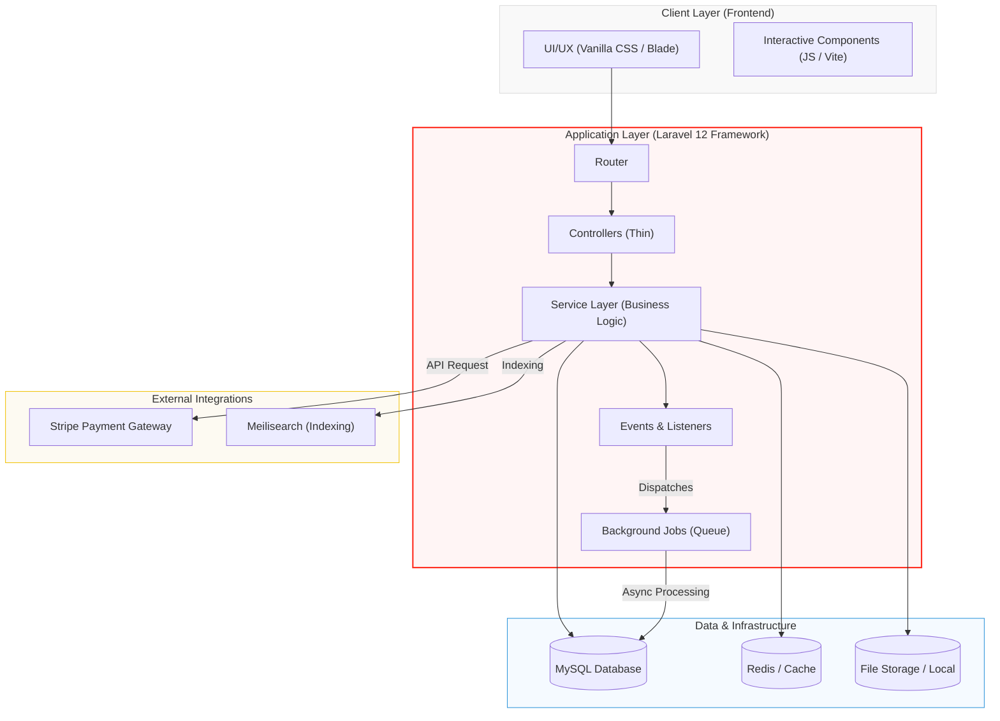

# ⚜️ Luxe Parfum - Professional eCommerce Portfolio Project

<p align="center">
  
  <br>
  <strong>A high-performance Perfume eCommerce Solution developed with Laravel 12.</strong>
</p>

---

## 💎 Project Overview
This project is a comprehensive eCommerce system built to demonstrate advanced **Laravel 12** expertise, clean architecture, and data-driven business logic. It solves real-world retail challenges like accurate historical profit tracking, bilingual user experiences, and high-performance data reporting.

---

## 🛠️ System Architecture & Engineering

### 🛰️ High-Level System Design


---

### 🛡️ Pattern-Driven Development
The project adheres to modern design patterns to ensure scalability and maintainability:

- **MVC Pattern**: Strict separation of concerns between Model, View, and Controller.
- **Service Pattern**: Business logic is decoupled from Controllers into dedicated `Service` classes (e.g., `StripeService`, `ReportExportService`), facilitating reusability and unit testing.
- **Observer Pattern**: Leveraging Laravel's Event system to handle side effects (like generating invoices or awarding points) asynchronously without blocking the main request flow.
- **Price Snapshot Pattern**: A critical business pattern where order item costs are "frozen" during checkout to preserve audit integrity against future product price fluctuations.

### ⚙️ Core Infrastructure Components

#### 💳 Payment Gateway (Stripe)
- Integrated using a dedicated `StripeService`.
- Handles secure tokenization, webhooks for asynchronous payment confirmation, and automated order status reconciliation.

#### ⚡ High-Performance Caching
- **Implementation**: Utilizes Laravel's Cache wrapper (supporting Redis/File drivers).
- **Usage**: Caches complex report results and frequent inventory queries to reduce database load and improve response times for the dashboard.

#### 📂 File & Media Storage
- **Abstraction**: Uses the Storage facade to abstract file system interactions.
- **Features**: Supports Local or S3-compatible storage for PDF invoices and high-resolution product media, ensuring the system is cloud-ready.

#### 🏗️ Asynchronous Queues
- **Driver**: Configured for `database` or `redis` processing.
- **Examples**: Heavy tasks like **PDF Generation** and **Email Notifications** are dispatched to background jobs, providing a snappy, instant-response UI for the user.

---

---

## 🚀 Key Features

| Feature | Description |
| :--- | :--- |
| **Payment Gateway** | Professional **Stripe** integration for secure credit card transactions. |
| **Inventory Management** | Real-time stock tracking with low-stock alerts and automated status management. |
| **Slug Optimization** | Automated unique slug generation to prevent URL conflicts and improve SEO. |
| **Search Engine** | Fast, indexed search powered by Scout for instant product discovery. |
| **Media Handling** | Optimized image processing and storage for high-quality product displays. |

---

## 🔧 Modern Workflow & Tooling

To ensure project scalability and reliability, I implemented a modern development workflow:

- **Composer**: Managing PHP dependencies and ensuring a streamlined back-end setup.
- **NPM & Node.js**: Leveraged for front-end asset compilation through **Vite**, enabling fast HMR (Hot Module Replacement) and optimized production builds.
- **Database Migrations**: Version-controlled database schema management for easy deployment and collaboration.

---

## 📦 Installation & Setup

1. **Clone & Install Dependencies**
   ```bash
   git clone https://github.com/your-username/ecomm-perfumes.git
   composer install
   npm install
   ```

2. **Environment & Key**
   ```bash
   cp .env.example .env
   php artisan key:generate
   ```

3. **Database Setup**
   Create a database and update `.env`, then run:
   ```bash
   php artisan migrate --seed
   ```

4. **Build Assets & Launch**
   ```bash
   npm run dev
   php artisan serve
   ```

---

## 👨‍💻 Professional Focus
As a developer, my focus during this project was on **Data Integrity**, **System Scalability**, and **User Conversion**. By implementing a robust profit-tracking engine and a luxury-themed UI, I've demonstrated the ability to bridge the gap between technical code and business requirements.

---
<p align="center">Developed as a technical showcase for modern Laravel development.</p>
