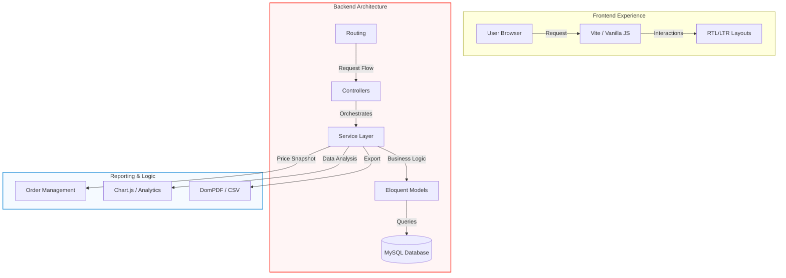

# ⚜️ Luxe Parfum - Professional eCommerce Portfolio Project

<p align="center">
  
  <br>
  <strong>A high-performance Perfume eCommerce Solution developed with Laravel 12.</strong>
</p>

---

## 💎 Project Overview
This project is a comprehensive eCommerce system built to demonstrate advanced **Laravel 12** expertise, clean architecture, and data-driven business logic. It solves real-world retail challenges like accurate historical profit tracking, bilingual user experiences, and high-performance data reporting.

---

## 🛠️ Technical Highlights & Architecture



### 🛡️ Robust Backend (Laravel 12 & PHP 8.2)
- **MVC & Service Pattern**: Organized business logic into dedicated Service Layers to ensure controllers remain thin, testable, and maintainable.
- **Advanced Eloquent ORM**: Implementation of complex relationships (One-to-Many, Belongs-To-Many) and custom Accessors/Mutators for dynamic data calculation.
- **Secure Authentication**: Utilizing Laravel's built-in security features, including CSRF protection, salted password hashing, and role-based access control.

### 📊 Business Intelligence (BI) Engine
- **Historical Price Snapshots**: A custom-built mechanism that captures `purchase_price` and `sale_price` at the moment of order creation. This ensures that profit reports remain accurate even if product prices are updated in the future.
- **Real-time Profit Analytics**: Dynamic calculation of Net Profit and Profit Margins (%) using optimized database queries and indexing.
- **Professional Reporting**: Integrated PDF and CSV export system with full support for Arabic/English terminology.

### 🎨 Premium UI/UX (RTL & LTR Support)
- **Glassmorphism Design**: A modern, sleek interface built with Vanilla CSS and modern JavaScript animations.
- **Full Localization**: Seamless switching between Arabic (RTL) and English (LTR) layouts without layout breaking.
- **Interactive Visualizations**: Real-time sales trends and payment distribution charts using **Chart.js**.

---

## 🚀 Key Features

| Feature | Description |
| :--- | :--- |
| **Inventory Management** | Real-time stock tracking with low-stock alerts and automated status management. |
| **Slug Optimization** | Automated unique slug generation to prevent URL conflicts and improve SEO. |
| **Search Engine** | Fast, indexed search powered by Scout for instant product discovery. |
| **Media Handling** | Optimized image processing and storage for high-quality product displays. |

---

## 🔧 Modern Workflow & Tooling

To ensure project scalability and reliability, I implemented a modern development workflow:

- **Composer**: Managing PHP dependencies and ensuring a streamlined back-end setup.
- **NPM & Node.js**: Leveraged for front-end asset compilation through **Vite**, enabling fast HMR (Hot Module Replacement) and optimized production builds.
- **Database Migrations**: Version-controlled database schema management for easy deployment and collaboration.

---

## 📦 Installation & Setup

1. **Clone & Install Dependencies**
   ```bash
   git clone https://github.com/your-username/ecomm-perfumes.git
   composer install
   npm install
   ```

2. **Environment & Key**
   ```bash
   cp .env.example .env
   php artisan key:generate
   ```

3. **Database Setup**
   Create a database and update `.env`, then run:
   ```bash
   php artisan migrate --seed
   ```

4. **Build Assets & Launch**
   ```bash
   npm run dev
   php artisan serve
   ```

---

## 👨‍💻 Professional Focus
As a developer, my focus during this project was on **Data Integrity**, **System Scalability**, and **User Conversion**. By implementing a robust profit-tracking engine and a luxury-themed UI, I've demonstrated the ability to bridge the gap between technical code and business requirements.

---
<p align="center">Developed as a technical showcase for modern Laravel development.</p>
