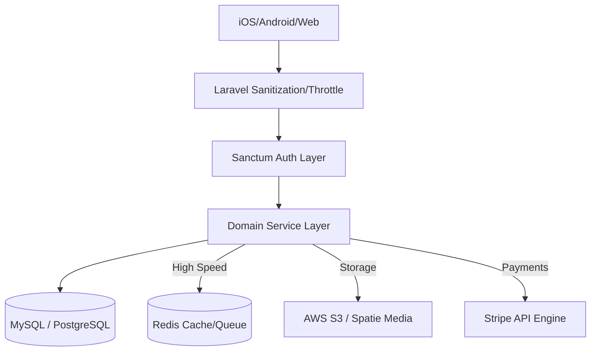

# ⚜️ Luxe Parfum: Enterprise-Grade eCommerce API

<p align="center">
  
  
  
  
  
</p>

Luxe Parfum is a high-performance, secure RESTful API architected for premium perfume retail. Designed with a **Mobile-First** and **SPA-Ready** mindset, it demonstrates senior-level proficiency in Laravel 12, clean architecture, and enterprise security protocols.

---

## 🏛️ 1. Professional Architecture & SoC
The project strictly follows a **Hexagonal-inspired Layered Architecture**, ensuring zero business logic leakage into the transport layer.

### 🧩 Logic Separation
- **Controllers**: Thin traffic managers handling request orchestration and delegation.
- **Service Layer**: The core business engine. Encapsulates complex logic (Stripe payments, inventory snapshots, profit analytics).
- **Form Requests**: Dedicated validation layer ensuring 100% data integrity before processing.
- **Eloquent Resources**: Decoupled presentation layer converting internal models into versioned, mobile-optimized JSON.
- **Redis Caching**: Sub-second performance for high-traffic endpoints (Catalog, Search).

### 🗺️ Infrastructure Overview

```mermaid
graph TD
    Client[iOS/Android/Web] --> Gate[Laravel Sanitization/Throttle]
    Gate --> Auth[Sanctum Auth Layer]
    Auth --> Service[Domain Service Layer]
    Service --> Persistence[(MySQL / PostgreSQL)]
    Service -- High Speed --> Redis[(Redis Cache/Queue)]
    Service -- Storage --> S3[AWS S3 / Spatie Media]
    Service -- Payments --> Stripe[Stripe API Engine]
```

---

## 🔐 2. Security & Data Integrity
- **Authentication**: Stateless token-based security via **Laravel Sanctum**.
- **Granular Throttling**: Intelligent rate limiting differentiated by user role and endpoint sensitivity.
- **Enterprise Security Headers**: Implementation of HSTS, CSP, and X-Frame protection at the middleware level.
- **Data Protection**: 100% implementation of **Soft Deletes** for business audit accuracy and database integrity.

---

## 🚀 3. Key Technical Features
- **Payment Orchestration**: Full Stripe integration with Webhook synchronization for secure checkouts.
- **Dynamic Localized Discovery**: Advanced searching (Scout) and filtering supporting English & Arabic.
- **Optimized Media Engine**: Auto-optimization and thumbnail generation via Spatie Media Library.
- **Async Processing**: Heavy tasks (Invoices, Emails, Job Exports) handled via background workers.

---

## 📖 4. Developer Experience (DX)
The project is built to lead with transparency and ease of integration.

### 🌐 Live Documentation Portal
The API features an interactive **Scribe-powered Developer Portal** accessible at `/docs`.
- **Interactive Console**: "Try it out" feature for all 18+ endpoints.
- **SDK Exports**: Automated generation of **Postman Collections** and **OpenAPI/Swagger** specs.
- **Code Samples**: Ready-to-use snippets in Bash and JavaScript.

---

## 🧪 5. Testing & Quality Assurance
Quality is maintained through a rigorous automated testing suite.

```bash
# Run all API Feature Tests
php artisan test --testsuite=Feature
```

### Example Contract Test:
The system ensures that the product list contract remains immutable through deep JSON structure assertions.

---

## ⚙️ 6. Quick Start & Installation

1. **Clone & Environment Setup**
   ```bash
   git clone https://github.com/your-username/luxe-parfum-api.git
   cp .env.example .env
   composer install && npm install
   ```

2. **Backend Initialization**
   ```bash
   php artisan key:generate
   php artisan migrate --seed
   php artisan scribe:generate # Generate documentation
   ```

3. **Performance Ready**
   Ensure your Redis server is running for a sub-second caching experience.

---

## 📊 7. Folder Structure Highlights
```text
vendor/
app/
├── Http/
│   ├── Controllers/Clients/Api # Versioned REST Controllers
│   ├── Requests/Api            # Strict Validation Logic
│   └── Resources/Api           # JSON Presentation Layer
├── Services/                   # Core Business Logic (Brain)
└── Models/                     # Data Structures & Relationships
tests/
└── Feature/Api                 # Automated Contract & Logic Tests
```

---

<p align="center">
  <b>Built for Performance. Hardened for Enterprise. Portfolio-Ready.</b><br>
  <i>Luxe Parfum: A Senior Backend Engineering Project</i>
</p>
