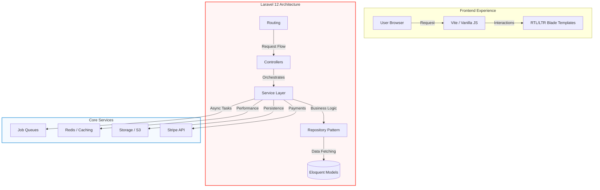
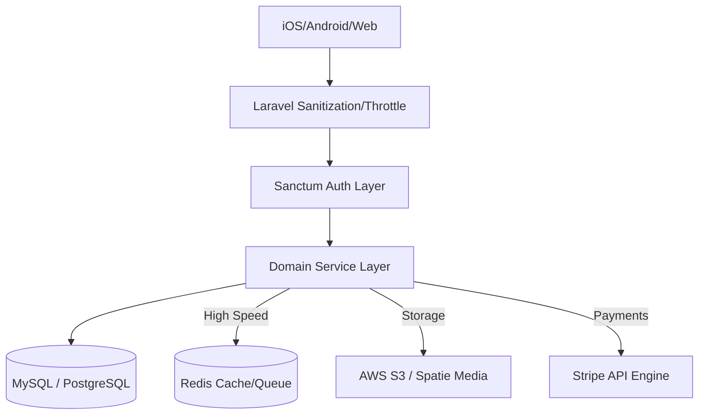

# ⚜️ Luxe Parfum - Professional eCommerce Portfolio Project

<p align="center">
  
  <br>
  <strong>A high-performance Perfume eCommerce Solution developed with Laravel 12.</strong>
</p>

---

## 💎 Project Overview
This project is a comprehensive eCommerce system built to demonstrate advanced **Laravel 12** expertise, clean architecture, and data-driven business logic. It solves real-world retail challenges like accurate historical profit tracking, bilingual user experiences, and high-performance data reporting.

---

## 🛠️ System Architecture & Design Patterns

### 🛰️ Technical Workflow Diagram

```mermaid
graph TD
    subgraph Client_Layer [Frontend Experience]
        A[User Browser] -- Request --> B[Vite / Vanilla JS]
        B -- Interactions --> C[RTL/LTR Blade Templates]
    end

    subgraph App_Layer [Laravel 12 Architecture]
        D[Routing] -- Request Flow --> E[Controllers]
        E -- Orchestrates --> F[Service Layer]
        F -- Business Logic --> G[Repository Pattern]
        G -- Data Fetching --> H[(Eloquent Models)]
    end

    subgraph Infrastructure_Layer [Core Services]
        F -- Async Tasks --> I[Job Queues]
        F -- Performance --> J[Redis / Caching]
        F -- Persistence --> K[Storage / S3]
        F -- Payments --> L[Stripe API]
    end

    style App_Layer fill:#fff5f5,stroke:#ff2d20,stroke-width:2px
    style Infrastructure_Layer fill:#f5faff,stroke:#3498db,stroke-width:2px
```

### 🛡️ Clean Architecture Implementation
This project follows a professional **Controller-Service-Repository** pattern to ensure a strict separation of concerns:

1. **Controllers**: Act as entry points, handling request validation and returning responses. They remain "thin" by delegating all logic to services.
2. **Service Layer**: The "Brain" of the application. It contains the business logic (e.g., calculating profits, processing discounts) and interacts with multiple repositories or external APIs.
3. **Repository Pattern**: Abstracting the data layer. It handles all Eloquent queries and data persistence, ensuring that the business logic is decoupled from the database structure.

---

### ⚙️ Core Infrastructure Components

#### 💳 Payment Gateway (Stripe)
- **Secure Integration**: Full implementation of Stripe API for professional credit card processing.
- **Webhook Handling**: Automated order status updates and synchronization even if the user closes the browser during payment.

#### ⚡ High-Performance Caching
- **Implementation**: Leveraging Laravel's Cache facade with Redis/File support.
- **Optimization**: Frequently accessed data like total sales, popular products, and dashboard KPIs are cached to ensure sub-second response times.

#### 📂 Unified Storage System
- **Abstraction**: Uses Laravel's Storage disk abstraction for easy switching between `Local` for development and `Amazon S3` for production.
- **Media Management**: Automated handling of product images, fragrance notes icons, and dynamically generated PDF invoices.

#### 🏗️ Scalable Job Queues
- **Background Processing**: Heavy operations such as **PDF Generation**, **Invoice Emails**, and **Search Indexing** are dispatched to queues.
- **Reliability**: Ensures that the user never experiences a delay while waiting for a heavy backend process to complete.

---

### 📊 Business Intelligence (BI) Engine
- **Historical Price Snapshots**: A custom-built mechanism that captures `purchase_price` and `sale_price` at the moment of order creation. This ensures that profit reports remain accurate even if product prices are updated in the future.
- **Real-time Profit Analytics**: Dynamic calculation of Net Profit and Profit Margins (%) using optimized database queries and indexing.
- **Professional Reporting**: Integrated PDF and CSV export system with full support for Arabic/English terminology.

### 🎨 Premium UI/UX (RTL & LTR Support)
- **Glassmorphism Design**: A modern, sleek interface built with Vanilla CSS and modern JavaScript animations.
- **Full Localization**: Seamless switching between Arabic (RTL) and English (LTR) layouts without layout breaking.
- **Interactive Visualizations**: Real-time sales trends and payment distribution charts using **Chart.js**.

### 🛡️ Data Integrity & Soft Deletes
- **Protection Against Data Loss**: Implementation of **Soft Deletes** across 13 core tables, ensuring historical data is preserved and recoverable.
- **Audit Preparedness**: Maintains a complete audit trail of deleted records (users, products, orders) for business intelligence and administrative recovery.

### ⚡ High-Performance Caching (Redis)
- **Infrastructure Readiness**: Implementation of Redis support using the **Predis** library, enabling sub-second data retrieval for high-traffic scenarios.
- **Scalable Architecture**: Configured to handle Caching, Session management, and Queue processing through Redis, significantly reducing database load.

### 💳 Secure Payment Gateway (Stripe)
- **End-to-End Encryption**: Professional integration of Stripe for secure, encrypted credit card transactions.
- **Automated Lifecycle**: Handling of payment intents, webhooks, and automated order status transitions upon successful payment.

---

## 🚀 Key Features

| Feature | Description |
| :--- | :--- |
| **Payment Gateway** | Professional **Stripe** integration for secure credit card transactions. |
| **Inventory Management** | Real-time stock tracking with low-stock alerts and automated status management. |
| **Slug Optimization** | Automated unique slug generation to prevent URL conflicts and improve SEO. |
| **Search Engine** | Fast, indexed search powered by Scout for instant product discovery. |
| **Performance** | **Redis** integration (via Predis) for advanced caching and session speed. |
| **Data Security** | **Soft Deletes** implemented across all tables to prevent accidental data loss. |
| **Media Handling** | Optimized image processing and storage for high-quality product displays. |

---

## 🔧 Modern Workflow & Tooling

To ensure project scalability and reliability, I implemented a modern development workflow:

- **Composer**: Managing PHP dependencies and ensuring a streamlined back-end setup.
- **NPM & Node.js**: Leveraged for front-end asset compilation through **Vite**, enabling fast HMR (Hot Module Replacement) and optimized production builds.
- **Database Migrations**: Version-controlled database schema management for easy deployment and collaboration.

---

## 📦 Installation & Setup

1. **Clone & Install Dependencies**
   ```bash
   git clone https://github.com/your-username/ecomm-perfumes.git
   composer install
   npm install
   ```

2. **Environment & Key**
   ```bash
   cp .env.example .env
   php artisan key:generate
   ```

3. **Database Setup**
   Create a database and update `.env`, then run:
   ```bash
   php artisan migrate --seed
   ```

4. **Build Assets & Launch**
   ```bash
   npm run dev
   php artisan serve
   ```

---

## 👨‍💻 Professional Focus
As a developer, my focus during this project was on **Data Integrity**, **System Scalability**, and **User Conversion**. By implementing a robust profit-tracking engine and a luxury-themed UI, I've demonstrated the ability to bridge the gap between technical code and business requirements.

---
<p align="center">Developed as a technical showcase for modern Laravel development.</p>

---

# ⚜️ Luxe Parfum: Enterprise-Grade eCommerce API

<p align="center">
  
  
  
  
  
</p>

Luxe Parfum is a high-performance, secure RESTful API architected for premium perfume retail. Designed with a **Mobile-First** and **SPA-Ready** mindset, it demonstrates senior-level proficiency in Laravel 12, clean architecture, and enterprise security protocols.

---

## 🏛️ 1. Professional Architecture & SoC
The project strictly follows a **Hexagonal-inspired Layered Architecture**, ensuring zero business logic leakage into the transport layer.

### 🧩 Logic Separation
- **Controllers**: Thin traffic managers handling request orchestration and delegation.
- **Service Layer**: The core business engine. Encapsulates complex logic (Stripe payments, inventory snapshots, profit analytics).
- **Form Requests**: Dedicated validation layer ensuring 100% data integrity before processing.
- **Eloquent Resources**: Decoupled presentation layer converting internal models into versioned, mobile-optimized JSON.
- **Redis Caching**: Sub-second performance for high-traffic endpoints (Catalog, Search).

### 🗺️ Infrastructure Overview

```mermaid
graph TD
    Client[iOS/Android/Web] --> Gate[Laravel Sanitization/Throttle]
    Gate --> Auth[Sanctum Auth Layer]
    Auth --> Service[Domain Service Layer]
    Service --> Persistence[(MySQL / PostgreSQL)]
    Service -- High Speed --> Redis[(Redis Cache/Queue)]
    Service -- Storage --> S3[AWS S3 / Spatie Media]
    Service -- Payments --> Stripe[Stripe API Engine]
```

---

## 🔐 2. Security & Data Integrity
- **Authentication**: Stateless token-based security via **Laravel Sanctum**.
- **Granular Throttling**: Intelligent rate limiting differentiated by user role and endpoint sensitivity.
- **Enterprise Security Headers**: Implementation of HSTS, CSP, and X-Frame protection at the middleware level.
- **Data Protection**: 100% implementation of **Soft Deletes** for business audit accuracy and database integrity.

---

## 🚀 3. Key Technical Features
- **Payment Orchestration**: Full Stripe integration with Webhook synchronization for secure checkouts.
- **Dynamic Localized Discovery**: Advanced searching (Scout) and filtering supporting English & Arabic.
- **Optimized Media Engine**: Auto-optimization and thumbnail generation via Spatie Media Library.
- **Async Processing**: Heavy tasks (Invoices, Emails, Job Exports) handled via background workers.

---

## 📖 4. Developer Experience (DX)
The project is built to lead with transparency and ease of integration.

### 🌐 Live Documentation Portal
The API features an interactive **Scribe-powered Developer Portal** accessible at `/docs`.
- **Interactive Console**: "Try it out" feature for all 18+ endpoints.
- **SDK Exports**: Automated generation of **Postman Collections** and **OpenAPI/Swagger** specs.
- **Code Samples**: Ready-to-use snippets in Bash and JavaScript.

---

## 🧪 5. Testing & Quality Assurance
Quality is maintained through a rigorous automated testing suite.

```bash
# Run all API Feature Tests
php artisan test --testsuite=Feature
```

### Example Contract Test:
The system ensures that the product list contract remains immutable through deep JSON structure assertions.

---

## ⚙️ 6. Quick Start & Installation

1. **Clone & Environment Setup**
   ```bash
   git clone https://github.com/your-username/luxe-parfum-api.git
   cp .env.example .env
   composer install && npm install
   ```

2. **Backend Initialization**
   ```bash
   php artisan key:generate
   php artisan migrate --seed
   php artisan scribe:generate # Generate documentation
   ```

3. **Performance Ready**
   Ensure your Redis server is running for a sub-second caching experience.

---

## 📊 7. Folder Structure Highlights
```text
vendor/
app/
├── Http/
│   ├── Controllers/Clients/Api # Versioned REST Controllers
│   ├── Requests/Api            # Strict Validation Logic
│   └── Resources/Api           # JSON Presentation Layer
├── Services/                   # Core Business Logic (Brain)
└── Models/                     # Data Structures & Relationships
tests/
└── Feature/Api                 # Automated Contract & Logic Tests
```

---

<p align="center">
  <b>Built for Performance. Hardened for Enterprise. Portfolio-Ready.</b><br>
  <i>Luxe Parfum: A Senior Backend Engineering Project</i>
</p>
