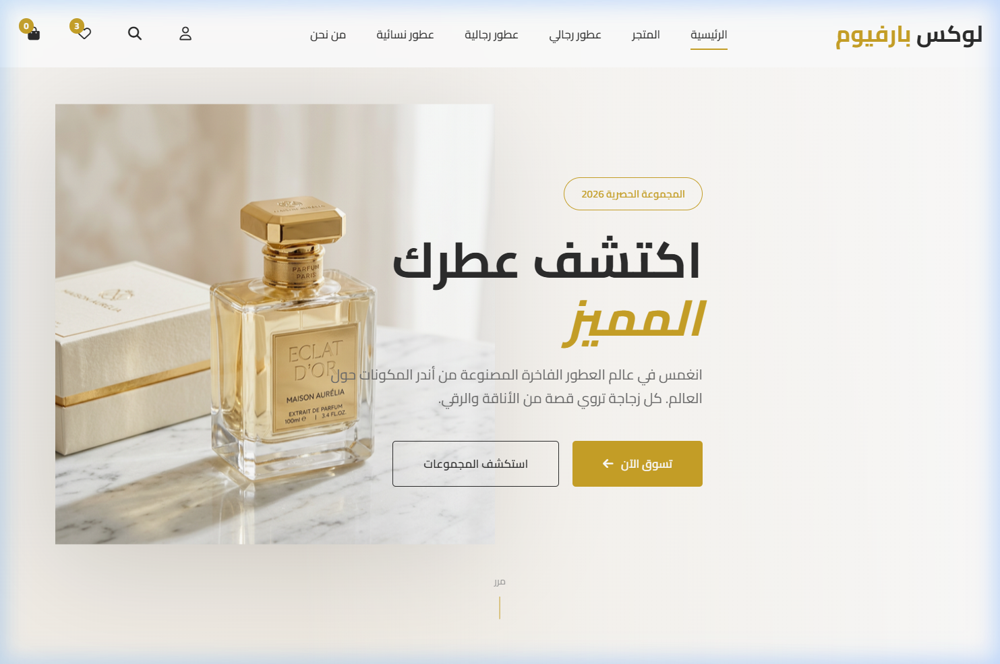
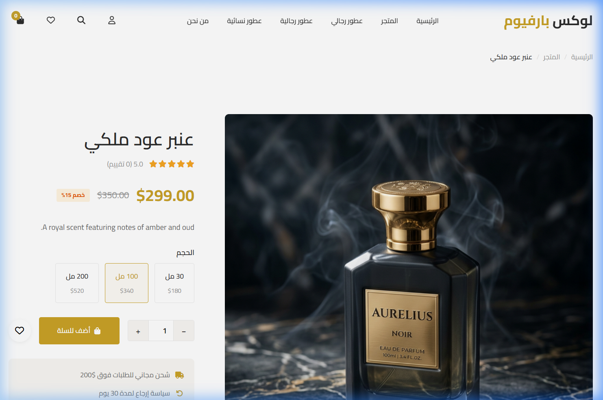
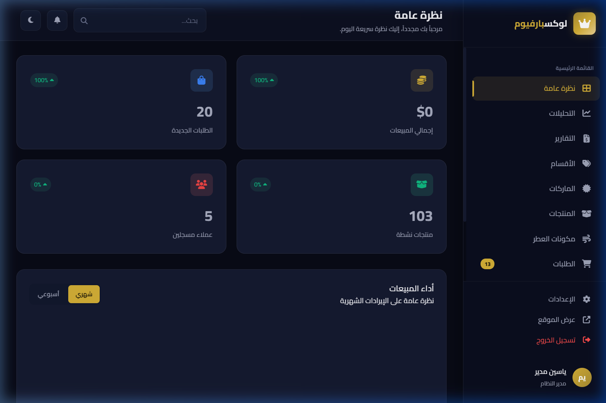

# ⚜️ Luxe Parfum — Enterprise eCommerce Platform


A **high-performance perfume eCommerce platform** built with **Laravel 12**, designed to demonstrate professional backend architecture, scalable business logic, and enterprise-level API development.

This project showcases modern Laravel engineering practices including **clean architecture, Redis caching, Stripe payments, and automated testing**.

---

# 📸 Screenshots

## Homepage



## Product Page



## Admin Dashboard



---

# 💎 Project Overview

Luxe Parfum is a full-featured **eCommerce system for premium fragrance retail**.

The platform solves real-world retail challenges including:

* Accurate **historical profit tracking**
* **High-performance product discovery**
* **Secure online payments**
* **Bilingual user experience (Arabic / English)**
* **Enterprise-grade reporting**

The system is designed to simulate a **real production-ready retail platform**.

---

# 🧠 System Architecture

The application follows a **Layered Clean Architecture** approach to ensure maintainability and scalability.

```
Client (Browser / Mobile)
        ↓
Controllers (HTTP Layer)
        ↓
Service Layer (Business Logic)
        ↓
Repositories (Data Access)
        ↓
Models (Eloquent ORM)
        ↓
MySQL Database
        ↓
Redis Cache & Queues
```

### Key Principles

* Thin Controllers
* Business logic isolated in Services
* Decoupled Data Access using Repositories
* API Resources for structured JSON responses

---

# 🚀 Key Features

### 💳 Secure Payment Gateway

* Full **Stripe API integration**
* Payment Intents workflow
* Webhook-based order synchronization

### 📦 Inventory Management

* Real-time stock tracking
* Low stock detection
* Automatic out-of-stock status

### ⚡ High Performance

* Redis caching
* Optimized database queries
* Background job queues

### 📊 Business Intelligence Engine

* Historical **purchase & sale price snapshots**
* Profit margin analytics
* Exportable reports (PDF & CSV)

### 🌍 Localization

* Full **Arabic (RTL)** and **English (LTR)** support
* Language-aware UI rendering

---

# 🛍️ Client Experience

The platform provides a modern shopping experience with:

* Advanced product filtering
* Real-time search suggestions
* Persistent shopping cart
* Interactive wishlist system
* Multi-step secure checkout
* Stripe-powered payments

---

# ❤️ Advanced Wishlist System

The wishlist system was engineered as a **high-conversion user engagement tool**.

Features include:

* AJAX wishlist toggling
* Public shareable wishlists
* Move-to-cart functionality
* Real-time UI updates
* Dynamic recommendation system

---

# 📱 PWA & SEO Enhancements

The platform includes modern web optimizations:

* Progressive Web App (PWA) support
* Service Worker offline caching
* OpenGraph & Twitter metadata
* SEO-friendly product URLs

---

# 👤 User Account Dashboard

Users have access to a complete account management center:

* Order history and tracking
* Wishlist management
* Address book (CRUD)
* Password and security controls
* Personalized dashboard insights

---

# 🧰 Tech Stack

### Backend

* Laravel 12
* PHP 8.2
* MySQL

### Performance

* Redis
* Laravel Queues

### Payments

* Stripe API

### Search

* Laravel Scout

### Documentation

* Scribe API Documentation

### Testing

* PHPUnit

### Frontend

* Blade
* Vanilla JavaScript
* Chart.js

---

# 🧪 Automated Testing

The project includes a comprehensive testing suite.

✔ **31 automated tests**
✔ **155 assertions**
✔ Feature tests
✔ Unit tests
✔ API tests

Run the tests:

```
php artisan test
```

Example:

```
php artisan test tests/Feature/Api/OrderApiTest.php
```

---

# 🔐 Security Features

The platform includes multiple layers of security:

* Laravel Sanctum authentication
* Role-based access control
* Security headers (HSTS, CSP)
* Rate limiting
* Soft delete protection

---

# 📖 API Documentation

The project includes a **developer-friendly API documentation portal** powered by Scribe.

Access the documentation:

```
/docs
```

Features:

* Interactive request testing
* OpenAPI export
* Postman collection generation

---

# ⚙️ Installation

### Clone the repository

```
git clone https://github.com/your-username/ecomm-perfumes.git
```

### Install dependencies

```
composer install
npm install
```

### Configure environment

```
cp .env.example .env
php artisan key:generate
```

### Database setup

```
php artisan migrate --seed
```

### Run the application

```
npm run dev
php artisan serve
```

---

# 🧑💻 Development Workflow

Modern tooling was used to maintain code quality:

* Composer dependency management
* Vite asset bundling
* Database migrations
* Environment configuration

---

# 🎯 Engineering Focus

During development, the primary focus areas were:

* **Data integrity**
* **System scalability**
* **Performance optimization**
* **Clean architecture**
* **Developer experience**

---

# 📊 Portfolio Value

This project was developed as a **technical portfolio project** to demonstrate:

* Advanced Laravel architecture
* REST API engineering
* Scalable backend design
* Real-world business logic implementation
* **Security-first engineering mindset (Cybersecurity focus)**

---

# 👨💻 Author

**Yassin Ali Afifi**

**Cybersecurity Specialist & Backend Developer** — Laravel & API Engineering

*Specialized in web protection, secure code auditing, and building resilient production environments.*

---

# ⭐ Support

If you find this project useful, consider giving it a **star** on GitHub.
